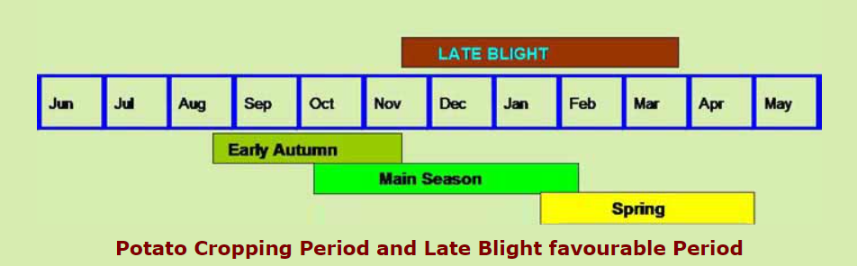

# Autonomous Potato leaf disease detection using Machine Learning appraoch

## Introduction
During some months of the year the potato plants suffer from some leaf diseases, known as *Blights*. These are formed and can be classified as two-staged disease:
- **Early blight** : Early blight of potato is caused by the *fungal pathogen Alternaria solani*. The disease affects leaves, stems and tubers and can reduce yield, tuber size, storability of tubers, quality of fresh-market and processing tubers and marketability of the crop.
In most production areas, early blight occurs annually to some degree. The severity of early blight is dependent upon the frequency of *foliar wetness from rain, dew, or irrigation*; the nutritional status of the foliage; and cultivar susceptibility.
- **Late blight** : Late blight is caused by the fungus like *oomycete pathogen Phytophthora infestans*. This potentially devastating disease can infect potato foliage and tubers at any stage of crop development. The primary host is potato, but P. infestans also can infect other solanaceous plants, including tomatoes, petunias and hairy nightshade, that can act as source of inoculum to potato.

## Comparison of Normal leaf VS Early blight VS Late blight
| Normal leaf |  Leaf with Early blight | Leaf with Late blight |
:-------------------------:|:-------------------------:|:-------------------------:
  |   | 

## Potato Cropping Period and Late Blight favourable Period

## Disease cycle 
- The fungus over-summers as mycelium in the infected seed potato kept in cold stores.
- These tubers when planted in the next crop season (main crop and subsequent ones) serve as the source of primary inoculum.
- When the plants emerge from such tubers, the fungus invades a few of the growing sprouts and sporulates (produce sporangia) under humid conditions. Further spread of the disease takes place by these sporangia through air or rain splashes.
- Initiation of the disease generally takes about 3-7 days before clearly visible symptoms develop. The fungus produces white sporulation on the underside of the leaves which is clearly visible in the early morning hours.
- These sporangia further infect new leaves and stems of the nearby plants and this cycle continues after every 4-10 days depending upon the prevailing temperature and humidity levels.
- If the temperature is lower than 100 C, disease development slows down and takes more time up to 12 days while at temperature of 16-180 C, it takes only 4-5 days to complete one cycle.
- Sporangia washed by rain or carried by irrigation water cause infection on tubers in the soil.
- Partially exposed tubers can easily become infected.
- These infected tubers serve as the primary source of inoculum for the next year's crop.

## Model evaluation
| Model | Accuracy |
:-------------------------:|:-------------------------:|
 VGG16   | _ |
 VGG16 (fine-tuned) | _ |
 VGG19 | _ |
 ResNet50 | _ |

